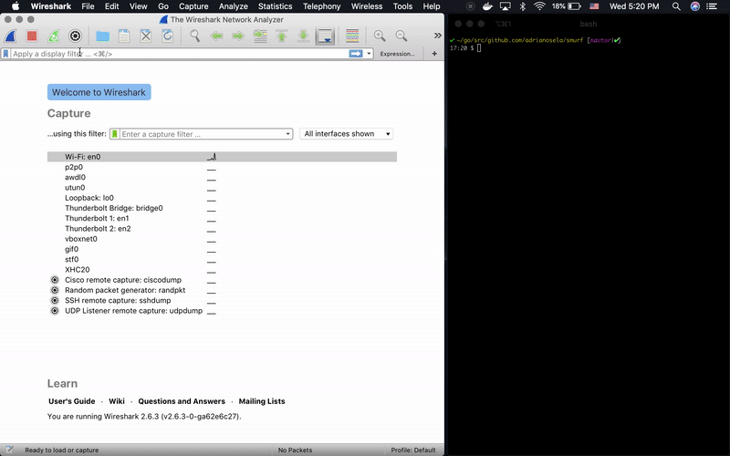

# smurf

[](https://goreportcard.com/report/github.com/adrianosela/smurf)
[](https://godoc.org/github.com/adrianosela/smurf)
[](https://github.com/adrianosela/smurf/blob/master/LICENSE)

carry out a smurf attack


### Usage:

* modify `main.go` to specify the desired victim IP address, as well as the IP corresponding to the network's broadcast address.

* build this directory with `go build`

```
$ go build
```

* run the program with privileged access:

```
$ sudo ./smurf
```

### Wireshark:

> example using my own host as the victim, with my LAN's broadcast as the network address:


